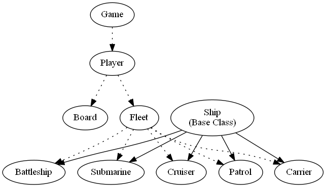
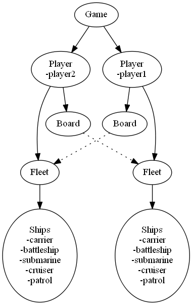

# battlestern
battlestern - a backend for the game battleship

Based on [Battleship Code Challenge](https://github.com/ambiata/interview/blob/master/battleship.md)

"Battleship was one of the earliest games to be produced as a computer game, with a version being released for the Z80 Compucolor in 1979." Wow and now I am doing it on Python in 2018, 39 years later. 

## Requirements
* Python 3.6.5
Probably works with earlier Python 3 versions - not tested.
Python 2 not supported.

* Docker 
Only if you want to run the tests that way, not essential

* virtualenv for Python


## Testing locally, with pytest and using Docker
The Dockerfile uses python3.6.5, creates a virtualenv, installs required pip packages
and launches the test runner, outputting results.

To test locally run py.test or just run test scripts with python directly
For Docker usage continue reading.


### First time usage

 build the docker image from the directory containing the Dockerfile
```bash
docker build -t battlestern .
```


### Build docker on Windows with OneDrive (obscure I know)
On Windows if the project directory is inside a OneDrive managed path then use the powershell wrapper build-docker.ps1 instead.

Make sure you have permissions to run powershell on your PC. If you never have then you will need to set it.
```powershell
Set-ExecutionPolicy RemoteSigned
```

Then run the Docker build script

```powershell
.\build-docker.ps1
```

### Run the docker image
```bash
docker run -it battlestern py.test --junitxml=/data/test_report.xml --cov-report xml:/data/coverage.xml
```


## Classes
A Game has 2 Players, each of which has a Board and a Fleet. A Fleet consists of 5 ships of each type. There are not "4 boards" in this game as suggested by the instructions, instead there are 2 Boards and 2 Fleets. The Fleet is used for a "Player's ship placement", and the Board tracks hits & misses against opponent ships.

  
_Diagram 1, shows the relationship between classes. Dotted lines represent the dependency chain, solid lines represent class hierarchy_

  
_Diagram 2, shows class instances in an game session. There are 2 players, each of which has a board and a fleet. A player's board has a relationship with the opponent's fleet._ 

* __Game__ 
   - Used as a container to hold all gameplay objects and functionality for a game session.
   - A new game can be started with random fleets or fleets can be defined and passed in.
   - Fleets, Boards and Ships cannot be altered once a game has begun.
   - Only player names may be altered.
* __Player__ 
   - Defined by a name.
   - Names have default `Bob` and `Alice` but can be changed.
   - Only 2 players allowed, no more no less.
* __Board__
   - A grid of 10x10, columns a-j and rows 1-10
   - Belongs to a player
   - Holds hits and misses for strikes against the player's opponent.
   - Calling a strike on a board coordinate will store & return a hit or miss.
   - Board will call opponent's Fleet and may alter that fleet's state if there is a hit.
* __Fleet__
   - Consists of 5 ship instances, 1 of each sub-type.
   - The fleet also tracks hits and sunk ships.
* __Ship__
   - A Base Class used to hold most of the functionality of ship sub-classes.
   - A ship has a nosecoordinate and orientation
   - NoseCoordinate is the coordinates of the bow (front) of the ship.
   - Orientation is either `'horizontal'` or `'vertical'`
   - Along with the length defined in the subclass, this is enough information to uniquely define ship placement on the grid.

* __Carrier, Battleship, Submarine, Cruiser, Patrol__
   - These Ship sub-classes only differ in their length attribute, 
   5, 4, 3, 2, 1 respectively.

## Starting a game
* Intantiating a new Game can be done explicitly with player names & defined fleet placement, or using defaults and random fleet layout.
* A fleet can be specified by passing a python dictionary (effectively JSON) for example
```json
{
    "carrier":{"col":"a",
            "row":1,
            "orientation":"horizontal"
            },
    "battleship":{"col":"a",
            "row":2,
            "orientation":"horizontal"
            },
    "submarine":{"col":"a",
            "row":3,
            "orientation":"horizontal"
            },
    "cruiser":{"col":"a",
            "row":4,
            "orientation":"horizontal"
            },
    "patrol":{"col":"a",
            "row":5,
            "orientation":"horizontal"
            }
}
```
_This example layout is probably a terrible strategy, as all the ships are bunched together in the top left quadrant of the graph. Probably better to space them out_ 

* row and col here represent the `NoseCoordinate` of the ship. 
* `battlestern` will validate the fleet layout to ensure 
   - none of the ships are overlapping in the grid
   - all of the ship coordinates are situated entirely within the grid
   - validation will not raise errors, just return duplicates & out_of_bounds properties of a Fleet
   this can be checked and dealt with as determined by the API client.

## Player Turns

* A playername and a coordinate is required to call the `strike` function.
   - It will not reject duplicate coordinate attempts


## Final notes
* No attempt at influencing garbage collection is made here, e.g. by decrementing reference counts. This can be done in the client if required.
* The code is only tested in Python 3, I don't see any point in supporting Python 2 if it is not necessary.


## Generating graph diagrams 
This is done using dot files and the cli (installed with graphviz)
e.g.
```bash
dot -o classes.png -Tpng .\classes.dot
dot -o game_objects.png -Tpng .\games_objects.dot
```

## TODOs
I've started to do these things:

* Docker container to launch a python virtualenv & run all tests
* Use [typing](https://docs.python.org/3/library/typing.html) & MyPy for type hints. It's good enough for Guido & Dropbox, it's good enough for everyone.
* Use [sphynx](http://www.sphinx-doc.org) for generating docs from all the module, class & function docstrings. I've already used the right syntax to make this straightforward.

## Taking it further
This is a very limited start and these are some things I would do to take it further:

* Complete test suites using [Pytest](https://docs.pytest.org/en/latest/)
* Use a persistent datastore, add 'gameid' to track multiple games and use a json file or SQLite at the very least, or Postgres or MongoDB if scaling is required.
* Add a front end with pretty interactive UI. [Pygame](https://www.pygame.org) is an awesome library for that
* Use processes for multiprocessing to allow the UI and multiple games to run, this is something that this library shouldn't worry about though, it's something for the client to manage.
* Add some enemy AI to allow play vs computer , or computer vs computer simulation. 
   - A 'random strike' function that would take into account previous strikes
   - avoid wasted duplicate strikes
   - maximize ship sinking probability, e.g. cluster strikes near existing hits - if they don't already represent a sunk ship. There's probably some papers about optimizing battleship AI given how popular this game is for computerization.
